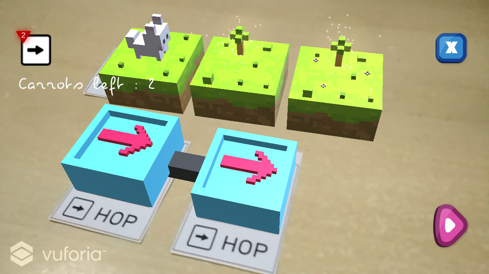
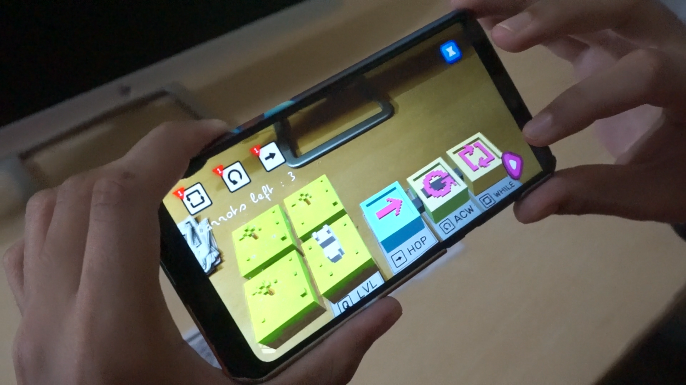

# CodAR

An Augmented Reality Game to teach Middle School Students how to program in a fun, interactive and engaging manner.

Download the android package : [Android Package](CodAR.apk)

Download the markers : [Markers](markers)

Watch the video : [Youtube](https://youtu.be/b4e21Py2_rw)

